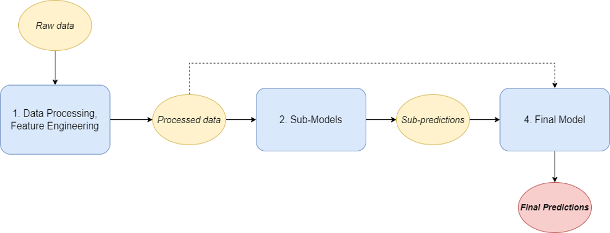
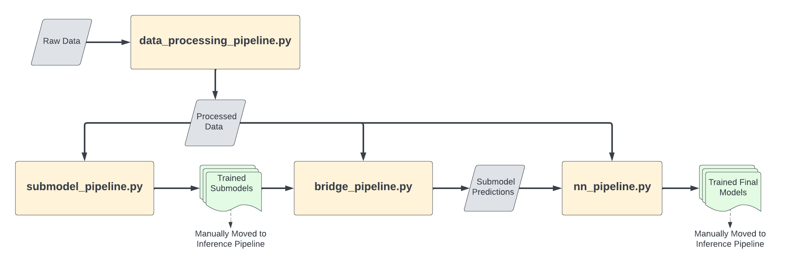
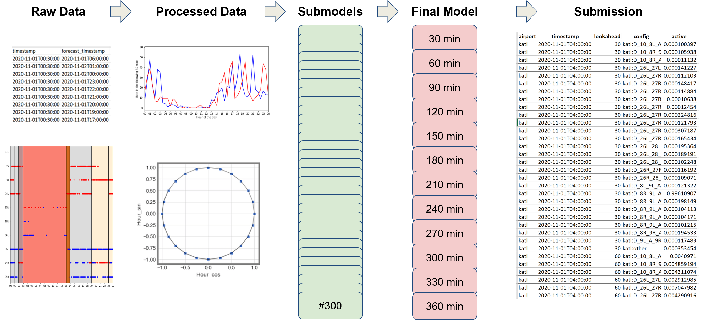

# Runway Function Submission

MIT AeroAstro team code submission for **DrivenData.org** [Runway Functions Competition](https://www.drivendata.org/competitions/92/competition-nasa-airport-configuration-prescreened/).


## Overall Architecture 



The overall approach presented in this paper involved three main components. The first was Data Processing - performing feature engineering on the raw data to create understandable features for prediction models. The second was Submodels - train prediction models that learn relevant subtasks that are related to the overarching task of predicting runway configurations. The third and last component was the Final Model - train dense neural network that leverages the outputs of the submodels to make the final probability predictions. The fundamental idea behind the approach presented was that the submodels would find a smaller (latent) feature space that encapsulates the information that is relevant to the problem at hand. From there, the final model could use the wisdom from all the submodels to make its final prediction. In making submissions, it was found that the model could not adequately account for configuration inertia (the tendency for configurations not to change). As such, a novel approach we called Minimum Configuration Support was introduced to explicitly account for configuration inertia.


## Setup

There are two main directories in this repository: inference_src and training_src. The training_src contains the training pipeline for both the submodels and final models. Once traning_src is run to train these models, they are used in the inference pipeline, allowing for runtime predictions.


 - Ensure Python requirements are set up using the runtime enviroment file.

 ```bash
 conda env create -f environment-gpu.yml  # or use environment-cpu.yml for machines without GPU support
 conda activate nasa-airport-config-runtime
 ```

 - Ensure that directories are correct in `const.py` in both training and inference src directories.
   - `DATA_DIR`: Where raw data is stored
   - `SUBMISSION_FILE`: File that should be stored at submission time
   - `SUBMISSION_FORMAT`: Location of the specified submission format (should have correct dates and times for predictions)
   - `PROCESSED_DATA`: Data file where processed data is stored
   - `MODEL_DIR`: Where trained final neural network models are stored
   - `SUBMODEL_DIR`: Where trained submodels are stored

- Ensure files are correct in the training const.py file

## Training

The training pipeline is contained in `training_src`.

```bash
cd training_src
pip install .  # install the src package
```

There are 4 main modules in the training pipeline that need to be run in sequence: `data_processing_pipeline.py`, `submodel_pipeline.py`, `bridge_pipeline.py`, `nn_pipeline.py`. The figure below shows how these pipelines are connected to create the full training pipeline



The pipelines need to be run in succession to train submodels and final models. The individual pipelines complete the following tasks:

* `data_processing_pipeline.py`: loads the raw data and creates processed features for every airport and timestamp., also creates train, val and test masks
* `submodel_pipeline.py`: loads processed data and trains all submodels for all airports.
* `bridge_pipeline.py`: loads processed data and submodels and creates submodel predictions for every timestamps and airports. Saves these predictions
* `nn_pipeline.py`: loads submodel predictions and processed data and trains final models for all airports and lookaheads.

**Important Note:** These pipelines need to be run to completion in succession - i.e. do not execute the next pipeline unless the previous one has finished running. They should be executed in the order above. An example of this is shown in the main.ipynb.

Additionally, certain hyperparemeters such as early stopping, epochs, etc can be changed in their respective pipelines. 

The tree below shows additional detail about how the `training_src` directory is structured. `data` is where raw data should be placed. `src` contains functions necessary for the correct functioning of the pipelines. 
* `feature_processing_functions.py` contains functions that are used by `data_processing_pipeline.py`
* `submodel_preparator.py` contain classes inherited from a `DataPreparator` class. These serve as a bridge between processed data and submodels - they complete final preprocessing steps, such as processing labels.
* training contains additional structures neccessary for the final models - custom NN layers, the neural network architecture and autokeras definitions.

```
training_src
├── data -------------------------------------> File that holds raw data
      ├──
├── src
      ├── feature_processing_functions.py ----> Contains feature processing functions
      ├── submodel_preparators.py ------------> Defines preprator function to perform data processing
      ├── const.py ---------------------------> File locations and other constants
      ├── helpers.py -------------------------> Some useful helper functions
      ├── data_processing_pipeline.py --------> Defines pipeline to process raw data
      ├── submodel_pipeline.py ---------------> Defines pipeline to train submodels
      ├── bridge_pipeline.py -----------------> Defines pipeline to construct training data for NN
      ├── nn_pipeline.py ---------------------> Defines pipeline to train neural network
      └── training
              ├── custom_layers.py -----------> Custom layers used in training
              ├── neural_network.py ----------> Custom AutoKeras model setup
              └── ak
                  ├── ak_const.py
                  └── ak_utils.py
├── main.ipynb -------------------------------> Combines all pipelines to train everything
```


## Inference



The overall prediction pipeline is straight forward. As the description above describes, there are five overall steps:
 - Raw Data
 - Data Processing
 - Submodel Predictions
 - Final Model Predictions
 - Match Predictions to Submission Format

To make the predictions easy, all steps have been wrapped into one function called `make_predictions`, in the following way:


```
pred_df, dp_time, sub_time, final_time = make_predictions(SUBMISSION_FORMAT, date_range)
```

 - Inputs
   - SUBMISSION_FORMAT: String pointing to the submission format file that a prediction submission will be made from
   - date_range: pd.date_range that tells the code over which time interval it should download the data

- Outputs
  - pred_df: DF that matches SUBMISSION_FORMAT exactly with the model predictions in the active column
  - dp_time: time to accomplish data processing
  - sub_time: time to accomplih submodel predictions
  - final_time: time to accomplish final model predictions


- ***Important Notes*** 
  - Presntly the code is setup such that it will only read the last few hundred lines of the processed data. The number of lines that each feature is skipped is hardcoded in the file. This is in the effort to preserve memory and dataprocessing speed during runtime executution. If desired, this number can be changed in the [inference_src/src/data_processing.py](https://github.com/Traava/Runway_Functions_Submission/blob/main/inference_src/src/data_processing.py) file.
  - The inference pipeline will presently only show predictions for only the airport/time/config/lookahead present in the submission format. For example, if configurations are missing from the submission format, the `make_predictions` function will drop the missing ones from the final prediction dataframe. Ensure that submission format in the correct format.

```
inference_src
├── src
      ├── const.py ---------------------> File locations and other constants
      ├── custom_layers.py -------------> Defines custom layers used in script
      ├── data_processing.py -----------> Defines overall data processing function
      ├── feature_processing.py --------> Defines feature processing
      ├── helpers.py -------------------> Some useful helper functions
      ├── make_prediction.py -----------> Defines the make prediction function
      ├── neural_network.py ------------> Defines layers and loss neccesary to load tf model
      ├── submodel_predictions.py ------> Function to make submodel predictions
      ├── submodel_preparators.py ------> Defines preprator function to perform data processing
      └── ak ---------------------------> Defines Autokeras functions so ak is not necceary for runtime
          ├── ak_const.py
          └── ak_utils.py 
└── main.py ----------------------------> Inference script
```

## Authors

- [@s-t-mcdonald](https://github.com/s-t-mcdonald)
- [@Traava](https://github.com/Traava)
